# Blender PIE Basics

This guide is based on subjective experience with the Blender PIE add-on.
The purpose of this guide is to explain the basics, using the Blender PIE add-on for import and export. 
The add-on is adding PIE object properties to Blender.
Thanks to great work done by John Wharton, PIE version 4 in now fully supported :)

It is highly recommended to first go through the PIE file format documentation to to understand the file structure and properties. 
- PIE File Format Documentation: [PIE.md](https://github.com/Warzone2100/warzone2100/blob/master/doc/PIE.md)

Additionally, read the PIE add-on readme, on how to install the add-on to Blender 2.9x version.
- PIE Add-on README: [README.md](https://github.com/Warzone2100/warzone2100/blob/master/tools/blender/2.9x/pie_addon/README.md)

To access the PIE files, extract the base.wz (a zip type archive) to a location of your choice.

## Object Types in Blender

As described in the add-on readme, objects in Blender can be assigned one of the following PIE Object Type values:

- **None:** Objects with this type will be ignored when exporting, but they may still be used in the Blender scene to manipulate objects which are eligible for PIE exporting.
- **Root:** This type is used to define the generic values of a PIE model, such as its version, rendering flags, textures, and events.
- **Level:** This type is used to define the mesh and animation properties which are specific to each level such as animation rate/cycles and texture animation data for particular sets of faces. These should always be mesh objects, and always be within the hierarchy of a Root PIE object.
- **Shadow:** This is Deprecated. Developers note: "This feature was added as a temporary workaround for performance issues with old stencil shadows, but we now have shadow mapping so it’s ignored."
- **Connector:** This type is used to define the location of a connector on a level. These should be parented directly to a Level PIE object.

## PIE Structure

### PIE Import Example

Let's start importing a PIE file, as it gives us a good example with the whole structure in place. Take the factory model blfact0.pie from the extracted base.wz/structs directory (mentioned earlier).
File -> Import -> Warzone 2100 model (.pie) 

On the top right Scene collection panel, you can see the objects hierarchy. 
The Root object is an Armature with the name of the imported PIE file (without .pie extension).
The armature has one bone for each level object. More on the bones later in animation.

The Level objects and their meshes are child objects of the armature. Level names start with the armature (pie) name, space, and end with Level + incremental number starting with 1.
If you are going to add additional levels (mesh objects), remember to set their parent to the Armature and create a bone for the new level with the same name schema in the Root armature.

Connector objects however, should be parented directly to a Level PIE object.

### Object Properties

Select the root armature object and look in the Object properties - PIE Object:

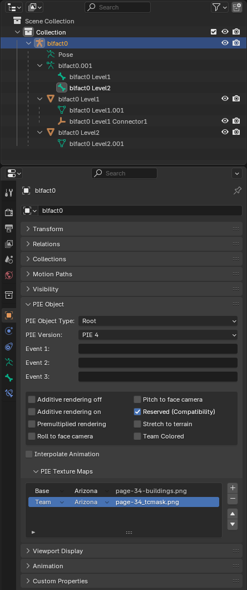

The import has set the Armature object type as Root with PIE version 4. 
Documentation states: Root- This type is used to define the generic values of a PIE model, such as its version, rendering flags, textures, and events.

Events are used to call another PIE file, that is used in case of an event in a game. For example a pie with the animation data. So you have your "static" PIE file that calls another animated PIE file version to be shown.

See that Reserved (Compatibility) is already checked, since the PIE type is set to 200 and that corresponds with "0x00200 -- Reserved for backward compatibility." 
Based on the PIE model you are working on, you can check the boxes you need. If unsure, see the documentation.
PIE Texture Maps show the base and team textures.  
Base, Team, Normal, and Specular maps can be defined.

Next, select the Level1 object. 

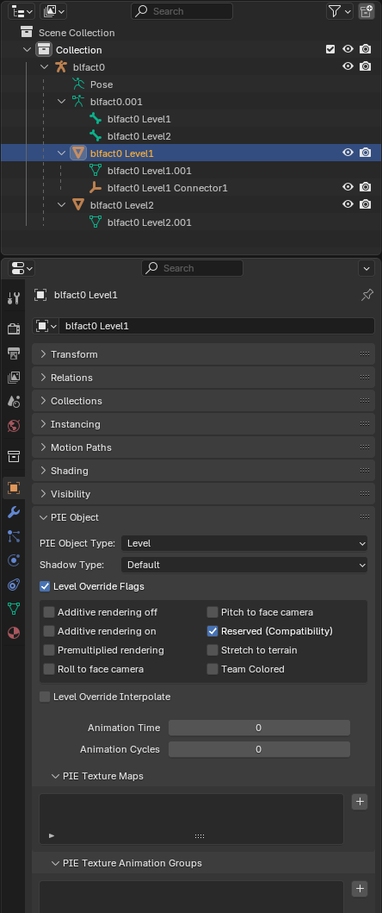

Levels are the mesh objects that are rendered in-game, such as the structures and units. As you can see, PIE Object Type is set to Level. All level child objects of the armature, that are set to Level will be exported.

Level Overrides - as described in documentation, you can set specific Flags, Interpolate and textures for each level. You can for example use different texture files for levels.

As per documentation, the connector is a child object of the Level object. Naming is the same as for level but with additional Connector + incremental number starting with 1

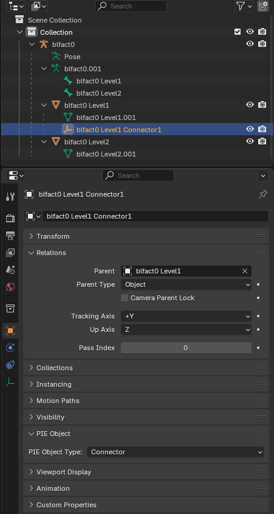

The Level2 object is a simple square made out of two triangles that are utilizing Texture animation.

## Texture animation

**PIE Texture animation groups** are set on levels and represent the group of polygons from the Level mesh that will be animated.

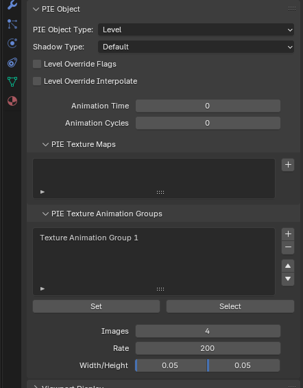

- **Images** represent the number of frames the animation will use.
- **Rate** is the playback rate. The units are game ticks per frame (effectively millisecond per frame)
- **width/height**  x and y size of the animation frame. The x value cannot be zero. Blender is rounding up the view so click into the value field to get the exact value.
X value is the distance by which the next frame will be offset. Y is not used, but if you want a texture animation to scroll vertically instead of horizontally, specify a width of 256.

To illustrate, we can see how it is set on the imported blfact0.

The Level 2 mesh is a square, made of two polygons, both assigned to animation group. In edit mode, you can click on select to check which polygons are assigned to the animation group. Also you can use the set button to assign polygons to an animation group.
Images are set to 4, which means 4 frames will be used. Those are the four vent circles in the texture. The first is already used as the default texture.
Rate is set to 200 milliseconds per frame.
Width and height are set to 0.045 - that is the x length by which the frame will move (jump) on x axis. It also the size of the square made of two polygons. The four frames in the texture are next to each other with no space between. So moving the frame by 0.045 will move (jump) it exactly one full frame.
The animation will cycle through the 4 frames repeatedly, one by one frame every 200 milliseconds, from left to right.

You are not limited to 4 frames. You can make smooth and high quality animations by using more frames. If you have more frames than you can fit in a row inside a texture, put the remaining frames in another row below the first one. 

Here is an example. Using a simple 8 blade fan design, we can animate 45 degrees rotation as a cyclic animation. Why 45 degrees? Because rotating the 8-bladed fan 45 degrees returns the symmetrical fan into its starting position. Using 20 images, 100x100 pixels rotating each by 2.25 degrees to the previous one. The rate set to 200, wight and height set to 0.049 since that is the size of one image that we have to move. And here it is:

## ANIMOBJECT animation

Let's import blderik_anim.pie as an example for the animobject animation. Once imported, switch to Animation view. Select the armature and switch to Pose Mode. Select the bones in top right panel. 

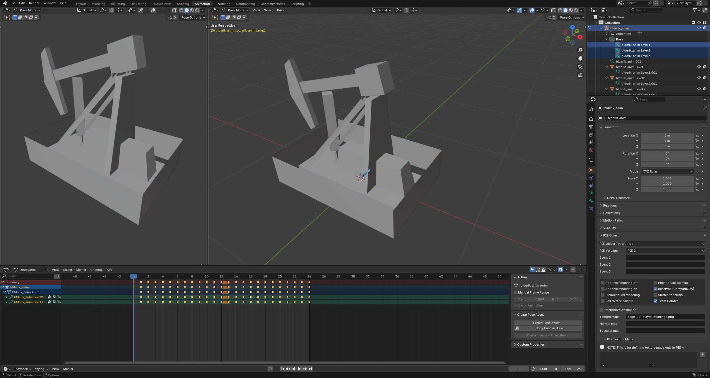

As you can see, the blderik_anim Level 2 "Piston" and  blderik_anim Level 3 "Hammer" have 24 keyframes set. The blderik_anim Level 1 has no keyframes set as the "base" is not animated.
You can set the end frame to 24 and test the playback with Space. As you can see, the animation is using rotation and location to animate the level objects. The bones hold the animation key frames data and they are the level object's parent. That way the object follows the bone movement and rotation.
The script will export all keyframes from 0 to the last key frame that has set animation data. If you have an animation with only few keyframes, there is no need to set each frame manually, as the export will create the in between frames for you.

Interpolate animation - it is important to remember that interpolate is by default on and it is represented by value 0. Checking the checkbox will set it to 1 and disable interpolate animation for the pie.
Normally 0 is off and 1 is on, but in this case it is reversed. Please remember this when exporting. If your animation in-game is jittery, test with enabled or disabled.

Animation time and animation cycles are set directly on the Level objects. Both blderik_anim Level2 and Level3 have the same values, animation time 60 and animation cycles 0 (0 is infinite repetitions).
You can set different animation time cycles if you want to have asynchronous animations for different Levels.

As mentioned before, the armature has three default bones, one for each level. If you would animate solely by moving and rotating objects and creating keyframes, you can set the keyframes to the object's default bone.
However, I recommend creating child bones and parenting the level object to the the bone and animating them that way. This is giving you much more control of positioning and advanced animation techniques.

Lets do the animation as an example.

The armature has three default bones, one for each level. If you would animate solely by moving and rotating objects and creating keyframes, you can set the keyframes to the object's default bone.
However, it is recommended creating child bones and parenting the bone to the default bone, animating them that way. This will give you much more control of positioning and advanced animation techniques.
Remember, we have only location, rotation, and scale values that we can use to animate the level objects. We are not able to animate the mesh, like mesh deform. The level object will be the child of the animation bone.

We should remove the imported animation data first. Switch to Animation Tab, select the bones blderik_anim Level 2 and blderik_anim Level 3, click into the timeline, and tap A key. This will select all keyframes.
Right click in the timeline and select Delete Keyframes

Let's start with the hammer. We want to create a bone to control the hammer movement. Expand the blderik_anim property to see the individual bones. Switch to front view, go to edit mode and select the blderik Level3 bone.

We will duplicate the bone with Shift+D and move (G+Z) it on the Z-axis to the hammer level. Rename the duplicated bone from blderik Level3.001 to Hammer.

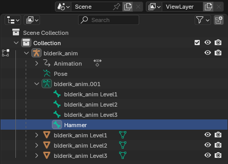

Align the bone with the level object. You can do it manually or use the 3D cursor. Switch to object mode, select the blderik Level 3 object (the mesh, not the bone) and switch to edit mode again. Change to wire-frame (Z), select all vertices of the square mesh, press Shift+S and select cursor to selected.

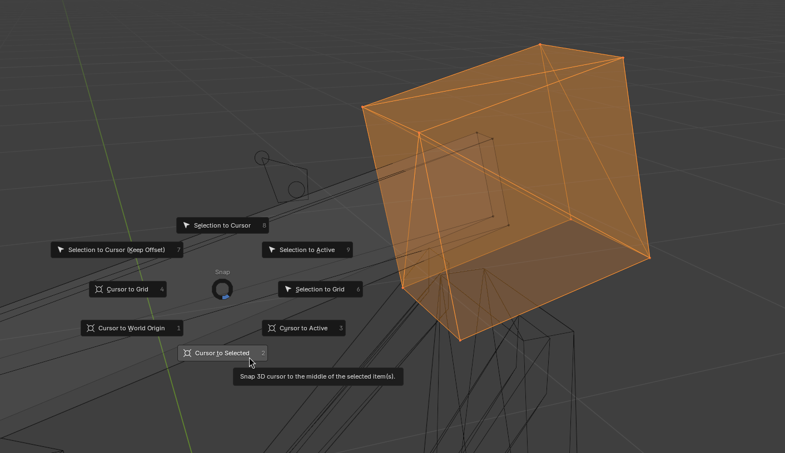

The 3D cursor is in the middle of the cube now. Switch to object mode, select the armature, switch back to edit mode and select the hammer bone. Select the ball on the root of the bone (the side where the bone is thicker), press Shift+S and Selection to cursor.

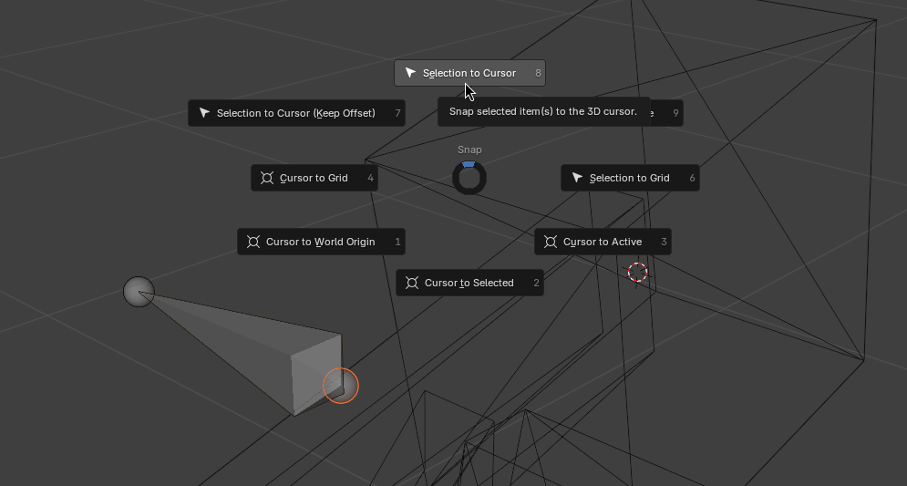

The root of the bone will snap to the cursor. Repeat the same with the other end of the hammer - cursor to selection. Switch to armature in edit mode, select the other end of the bone and Shift+S selection to cursor to snap the bone tip to the cursor.

Now the bone is aligned. Let's parent it to the blderik Level3 bone. It will look more organized in the hierarchy. Still in edit mode, select the blderik Level3 bone, hold shift and select the hammer bone. Move the cursor to the viewport and press ctrl+p and select keep offset.

The bone is now the child of the blderik Level3 bone. Now go back to object mode, select the object blderik Level3 right-click, select Parent and Clear Parent.

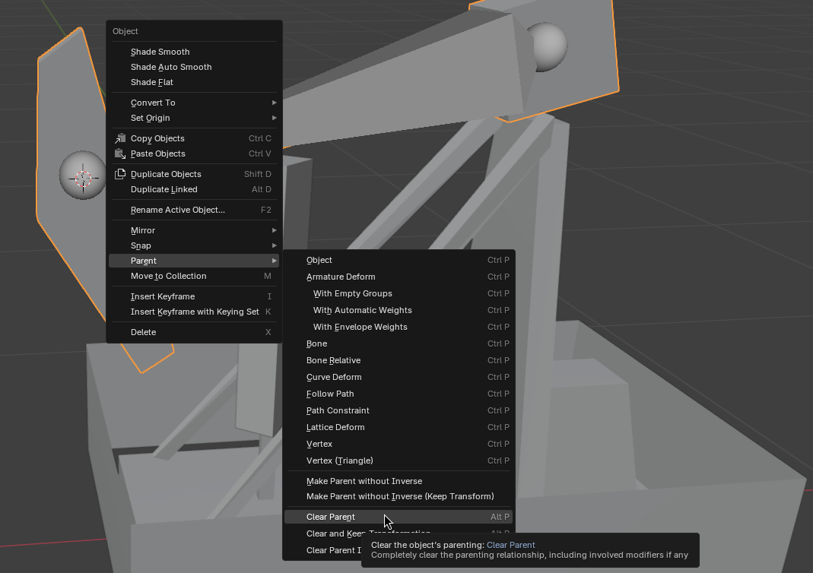

Now the object is not parented to the armature anymore.

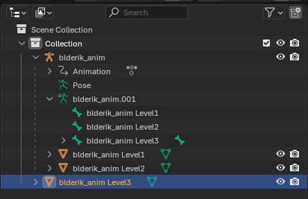

We need to parent the object to the hammer bone. Still in object mode, select the blderik Level3, hold shift and select the armature object, switch to pose mode, and select the hammer bone. Press ctrl+p and select bone.

The blderik Level3 is now again the child object of the armature, since the hammer bone is a child of the armature.

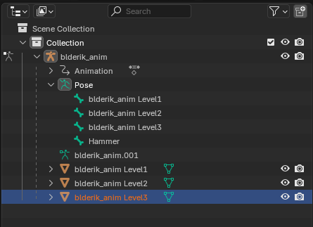

Now repeat the whole bone duplication, alignment, and parenting for the piston object blderik Level2. You should end up with something like this:

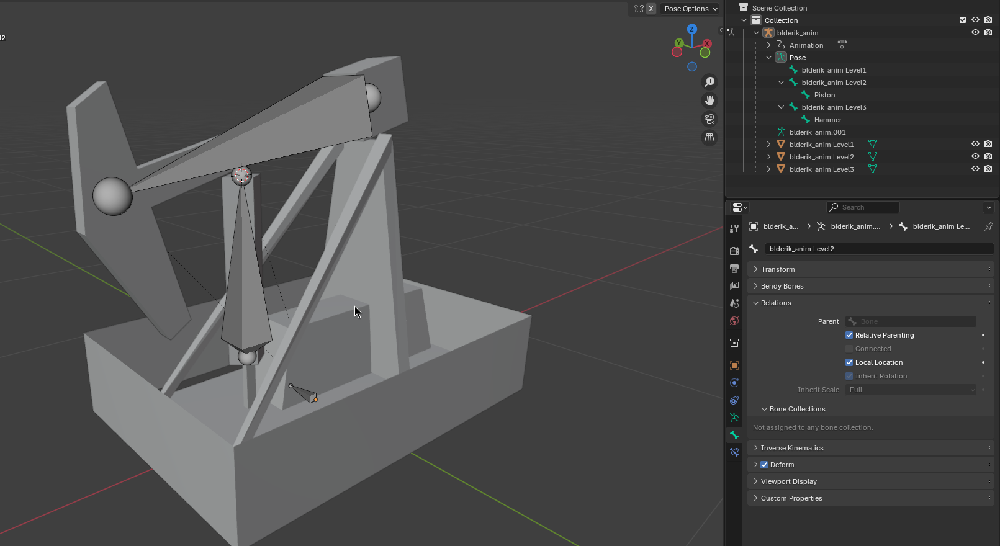

We will not make a bone for the blderik Level 1, as we do not need to animate the base structure and it will remain static. Now we are prepared for animating.

The script is exporting animations from frame 0 to the last frame containing a keyframe. This is fine for most animations, that are not circular.

Here however, we want to do a circular animation, that will seamlessly repeat it self. The full animation cycle will have 60 frames. Frame 0 and 60 will be the same Location, Rotation & Scale. We don't want to have two identical frames played, but go from frame 59 to 0, to have a seamless transition. Also we do not want to manually edit the exported PIE file, removing last frame from the file.
We have two options:
- Add a key to frame 59 and delete the frame 60 This way the last 59 frame will be exported. However, you may want to change the animation in the future and recreating the frame 60 could be difficult.
- Start the cycle animation from frame -1. Negative frames are ignored when exporting and you don't have to delete the last frame. This allows you to come back and do adjustments without loosing frame data.
To enable negative frames in Blender Edit -> Preferences -> Animation -> Allow Negative Frames

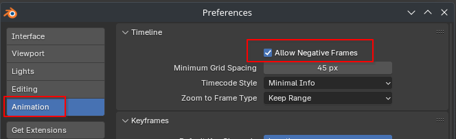

Switch to Pose mode, switch to view the derik from the side, hold down Shift and select both Piston and hammer bone. Now make sure the frame -1 is selected in the timeline, and right-click in the view and select Insert Keyframe.

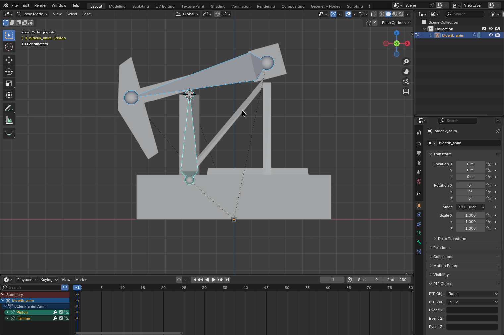

Select Location, Rotation & Scale. When you select the bones again, you can see the keyframe data on both of them.

Now let's select the frame 29, rotate the hammer bone, move the piston up on the Z-axis, and insert another keyframe.

Now go to frame 59, rotate the hammer back and move the piston back into the same position as on frame -1. If you want to be sure to have the exact starting position, you can copy the key frame -1 by selecting and right-clicking the points on frame -1. Then select frame 59, right-click and paste.

To check the animation, set the start frame to 0 and end frame to 59.

Now you can press Space to play the animation and ESC to stop it, or use the play stop buttons.

The animation is done, and we can do the export. Switch back to object mode. We need to set the cycles and frame time for both The Level3 "hammer" and the Level2 "piston" objects. Animation Cycles sets the number of repetitions for the animation. In our case, we leave it on 0. That means infinite repetitions. Animation Time is actually the time for one frame in milliseconds. Let's say we want the animation cycle to take two seconds (2000 milliseconds) to play. And we have 60 frames (0-59) . 2000 / 60 = 33.33 So we can set the value to 33. Set the same value for both Level3 "hammer" and the Level2 "piston." That way they will be in sync.
Leave Interpolate animation unchecked, and test in-game first.

Now let's export the PIE. Switch to object mode, select the armature. Change PIE Version to 4 and set the texture to page-11-player-buildings.png.

With the selected root armature, click on File - Export - Warzone 2100 model (.pie), select the location and click export PIE to directory.

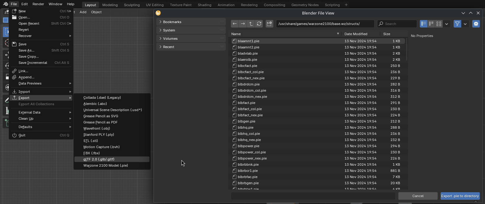
