# Blender PIE Basics

This guide is based on subjective experience with the Blender PIE add-on. The purpose of this guide is to explain the basics of using the Blender PIE add-on for import and export. The add-on adds PIE object properties to Blender.
Currently PIE upt to version 3 is supported. PIE version 4 support is being worked on by some community members.

Before proceeding, it is highly recommended to go through the PIE file format documentation and the PIE add-on readme to understand the files and how to install the add-on to Blender 2.9x version.

- PIE File Format Documentation: [PIE.md](https://github.com/Warzone2100/warzone2100/blob/master/doc/PIE.md)
- PIE Add-on README: [README.md](https://github.com/Warzone2100/warzone2100/blob/master/tools/blender/2.9x/pie_addon/README.md)

You need to access the PIE files, therefore extract the base.wz (a zip type archive) to a location of your choice.

## Object Types in Blender

As described in the add-on readme, objects in Blender can be assigned one of these PIE Object Type values:

- **None:** Objects with this type will be ignored when exporting, but they may still be used in the Blender scene to manipulate objects which are eligible for PIE exporting.
- **Root:** This type is used to define the generic values of a PIE model, such as its version, rendering flags, textures, and events.
- **Level:** This type is used to define the mesh and animation properties which are specific to each level such as animation rate/cycles and texture animation data for particular sets of faces. These should always be mesh objects, and always be within the hierarchy of a Root PIE object.
- **Shadow:** This is Deprecated. Developers note: "This feature was added as a temporary workaround for performance issues with old stencil shadows, but we now have shadow mapping so it’s ignored."
- **Connector:** This type is used to define the location of a connector on a level. These should be parented directly to a Level PIE object.

## PIE Structure

### PIE Import Example

Let’s start importing a PIE file, as it gives us an good example with the whole structure in place. Let's take the factory model blfact0.pie from the base.wz directory that was mentioned earlier.

The add-on was created before the PIE version 4 was released. So we have to do a small modification before we can import the PIE file. Version 3 and lower are supported, so do this only for the version 4.
Open the file with your preferred text editor and change the version on first line from "PIE 4" to "PIE3" and remove the line beginning with "TCMASK"

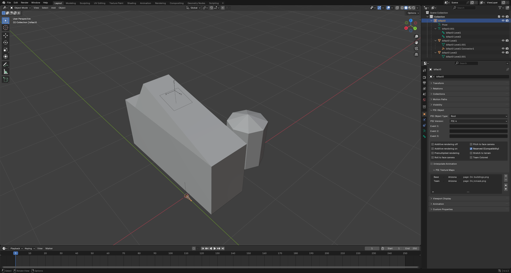

Now, import the model into Blender.

You can see on the right Scene collection panel, the Root object is an Armature with the name of the imported PIE. The armature has one bone for each level object. More on the bones later in animation.

The Level objects and their meshes are child objects of the armature. Level names start with the pie/armature name, space, and end with Level+incremental number starting with 1. If you are going to add additional levels, remember to set the parent to the Armature and create a bone for the new level with the same name schema in the Root armature. As you can see, the Connector objects are parented directly to the Level PIE object.

Connector objects however, should be parented directly to a Level PIE object.

### Object Properties

Now select the root armature object and look in the Object properties – PIE Object:

The import has set the Armature object type as Root with PIE version 3. Remember from the add-on documentation - Root: This type is used to define the generic values of a PIE model, such as its version, rendering flags, textures, and events. Also, see that “Reserved (Compatibility) already checked, since the PIE type is set to 200 and that corresponds with “0x00200 -- Reserved for backward compatibility.” Based on the PIE model you are working on, you can check the boxes you need. If unsure, see the documentation.
Texture, Normal, and Specular maps can be defined in corresponding fields.
Events are used to call another PIE file, that is used in case of an event in a game. For example a pie with the animation data. So you have your “static” PIE file that calls another animated PIE file version to be shown.

Next, select the Level1 object. Levels are the mesh objects that are rendered in-game as the structures and units. As you can see PIE Object Type is Level. All level child objects of the armature, that are set to Level will be exported.

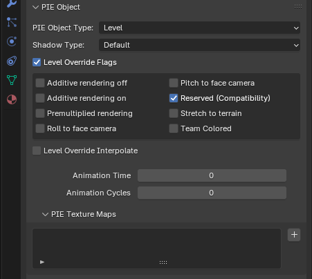

Shadow type can be ignored as the custom shadow points and polygons are now deprecated and replaced by the game engine shadow mapping. Animation Time and Animation cycles are used to determine animation properties. More on that later.

Select the Connector.

As per documentation, the connector is a child object of the Level object.

The Level2 object is a simple square object made out of two triangles that are utilizing Texture animation. Texture animation is documented, however, this guide is aimed at ANIMOBJECT animation type.

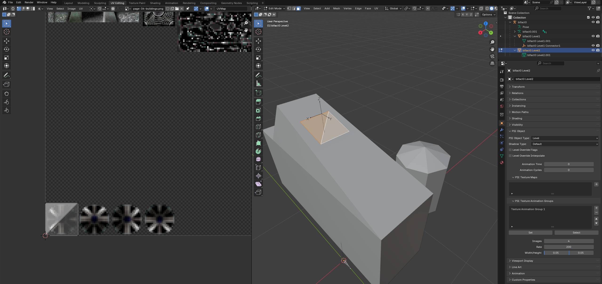

Last object type is None. As the documentation states: Objects with this type will be ignored when exporting, but they may still be used in the Blender scene to manipulate objects which are eligible for PIE exporting. This can be a picture for reference modeling, paths for animation, alignment objects, and so on.

One global rule to remember about all objects, no matter the PIE type: The object’s origin (the yellow dot), has to be always set to coordinates xyz (0,0,0) You cannot move the mesh for animation, only the object. Make sure that before you start animating, all Level object origins are always at xyz (0,0,0). 
Check it before export or animation, otherwise it can break the end result.

### Animation

Now that we have gone through the PIE structure and properties, let's do a basic animation. For that, we will import the blderik.pie and animate the levels using armature bones. You are probably asking yourself, why not import the blderik_anim.pie? Unfortunately, importing of PIE files with animation crashes with an error. So we have to start with the static model. Animation export works fortunately, so you can still come back to the blender file, adjust what is needed and re-export.

We see now a familiar structure. Armature root object named blderik as a parent and three levels, one for each mesh. Also, we see the boxes checked for Reserved and Team Colored, which is corresponding to the TYPE 10200.

We can also see the Event1 set to blderik_anim.pie, which defines which animation file will be loaded. Think of it as blderik.pie is static and when an event is triggered, it will be replaced by an animated blderik_anim.pie.

So we will remove the event and rename the blderik armature and the sub-property to blderik_anim. The armature name is used when exporting the PIE file. We can also save the blender file as blderik_anim.blend so save our state.

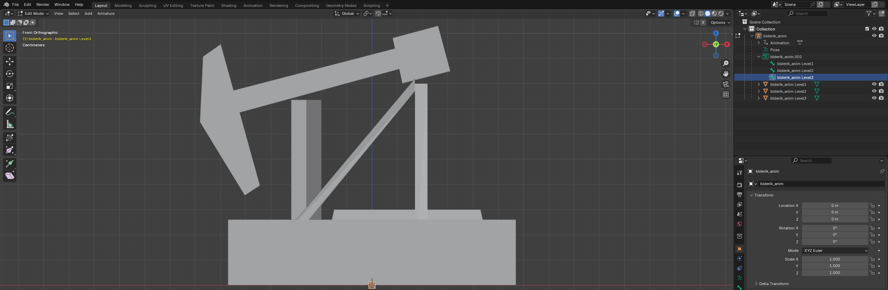

As mentioned before, the armature has three default bones, one for each level. If you would animate solely by moving and rotating objects and creating keyframes, you can set the keyframes to the object's default bone.

However, I recommend creating child bones and parenting the bone to the level object, animating them that way. This is giving you much more control of positioning and advanced animation techniques. You can even create separate bones under the root armature and parent them to the objects. Remember we have only location, rotation, and scale values that we can use to animate the level objects. We are not able to animate the mesh. Like mesh deform. The level object will be the child of the animation bone.

Selecting Level 2 highlights the “piston” and Level 3 highlights the “hammer.” Let's start with the hammer. We want to create a bone to control the hammer movement. Expand the blderik_anim property to see the individual bones. Switch to front view, go to edit mode and select the blderik Level3 bone.

We will duplicate the bone with Shift+d and move (G+Z) it on the z-axis to the hammer level. Rename the duplicated bone from blderik Level3.001 to Hammer.

Align the bone with the level object. You can do it manually or use the 3D cursor. Switch to object mode, select the Blderik Level 3 object (the mesh, not the bone) and switch to edit mode again. Change to wire-frame (Z), select all vertices of the square mesh, press shift+s and select cursor to selected.

The 3D cursor is in the middle of the cube now. Switch to object mode select the armature, switch back to edit mode and select the hammer bone. Select the ball on the root of the bone (the side where the bone is thicker), press shift+s and Selection to cursor.

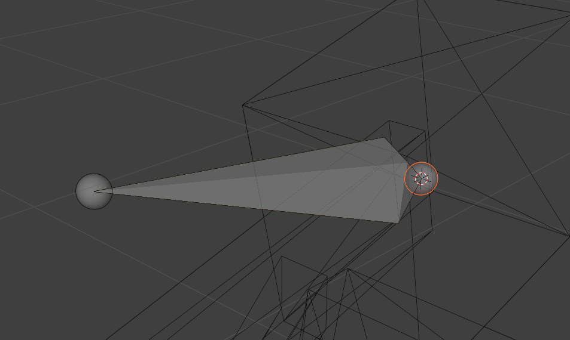
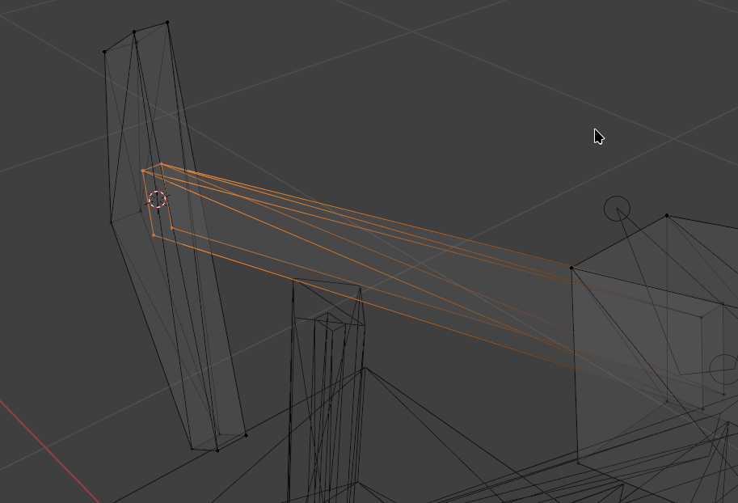

The root of the bone will snap to the cursor. Repeat the same with the other end of the hammer – cursor to selection. Switch to armature in edit mode, select the other end of the bone and shift+s selection to cursor to snap the bone tip to the cursor.

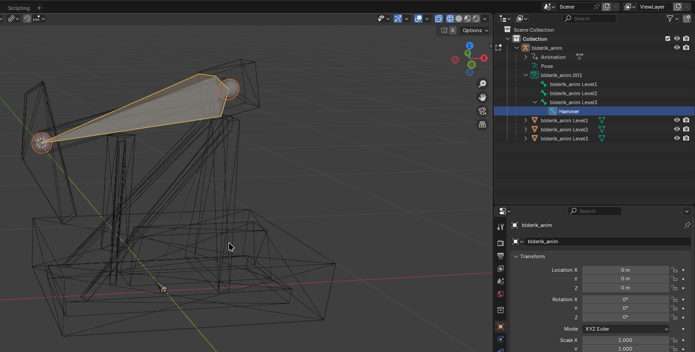

Now the bone is aligned. Let's parent it to the blderik Level3 bone. This step is not necessary, but it will look more organized in the hierarchy. Still in edit mode, select the blderik Level3 bone, hold shift and select the hammer bone. Move the cursor to the viewport and press ctrl+p and select keep offset.

The bone is now the child of the blderik Level3 bone. Now go back to object mode, select the object blderik Level3 right-click, select Parent and Clear Parent.

Now the object not parented to the armature anymore. 

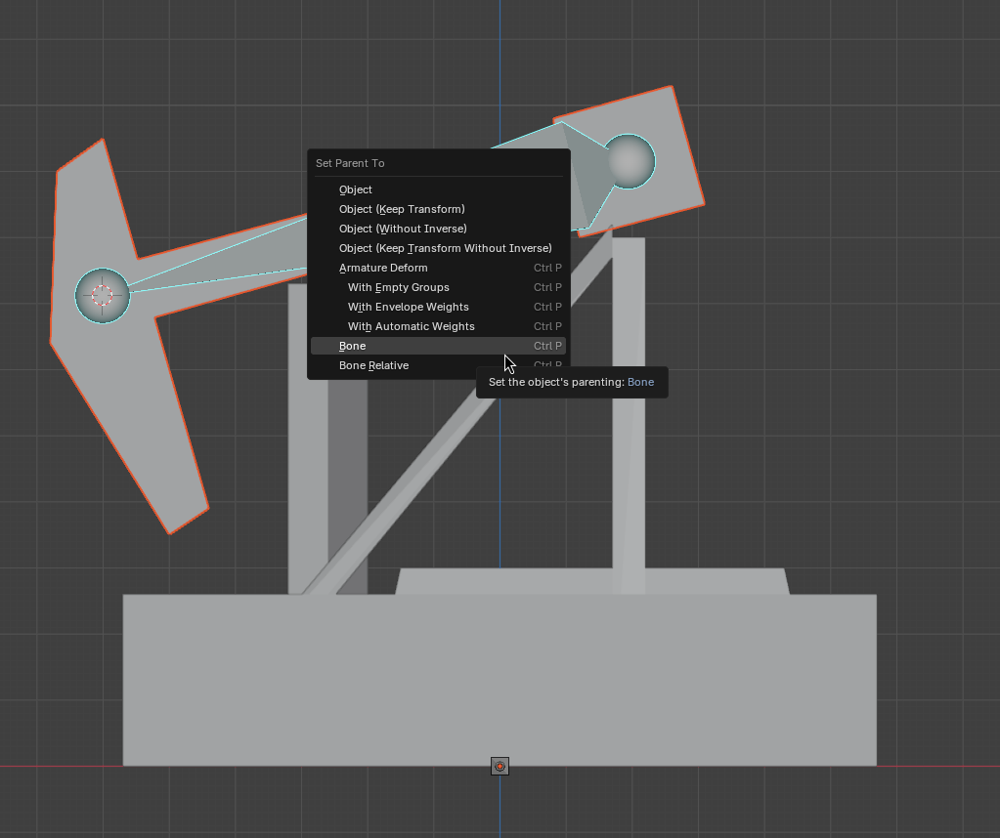

We need to parent the object to the hammer bone. Still in object mode, select the blderik Level3, hold shift and select the armature object, switch to pose mode, and select the hammer bone. Press ctrl+p and select bone.

The blderik Level3 is now again the child object of the armature, since the hammer bone is a child of the armature.

Now repeat the whole bone duplication, alignment, and parenting for the piston object blderik Level2. You should end up with something like this:

We will not make a bone for the blderik Level 1, as we do not need to animate the base structure and it will remain static. Now we are prepared for animating.

The script is exporting animations from frame 0 to the last frame containing a keyframe. This is fine for most animations, that are not circular.

Here however, we want to do a circular animation, that will seamlessly repeat it self. The full animation cycle will have 60 frames. Frame 0 and 60 will be the same Location, Rotation & Scale. We don't want to have two identical frames played, but go from frame 59 to 0, to have a seamless transition. Also we do not want to manually edit the exported PIE file, removing last frame from the file.
We have two options:
- Add a key to frame 59 and delete the frame 60 This way the last 59 frame will be exported. However, you may want to change the animation in the future and recreating the frame 60 could be difficult.
- Start the cycle animation from frame -1. Negative frames are ignored when exporting and you don't have to delete the last frame. This allows you to come back and do adjustments without loosing frame data.
To enable negative frames in Blender Edit -> Preferences -> Animation -> Allow Negative Frames 

Switch to Pose mode, switch to view the derik from the side, hold down shift and select both Piston and hammer bone. Now make sure the frame -1 is selected in the timeline, and right-click in the view and select Insert Keyframe.

Select Location, Rotation & Scale. When you select the bones again, you can see the keyframe data on both of them.

Now let's select the frame 29, rotate the hammer bone, move the piston up on the z-axis, and insert another keyframe.

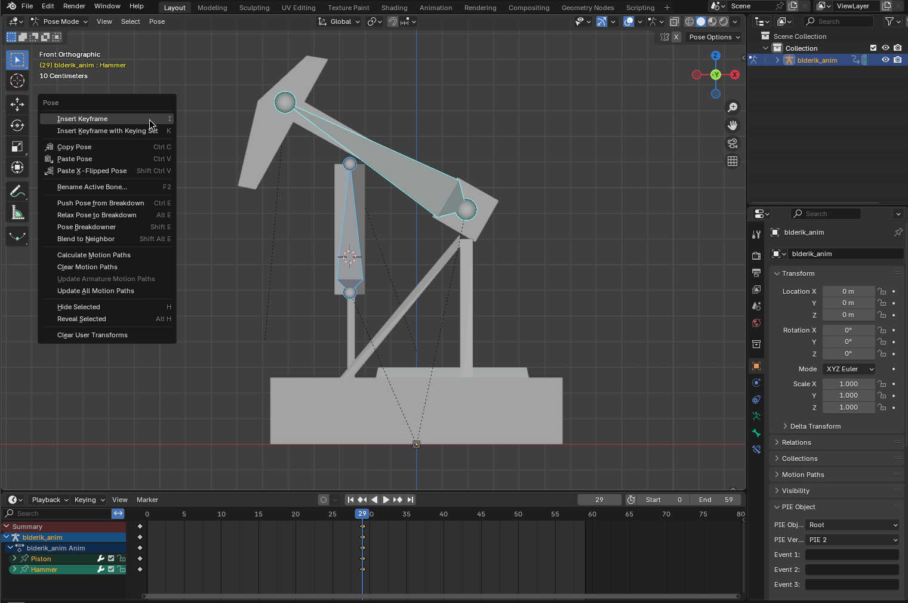

Now go to frame 59, rotate the hammer back and move the piston back into the same position as on frame -1. If you want to be sure, you can copy the frame -1 by right-clicking the points and selected keyframe and Copy. Then right-click frame 59 and paste.

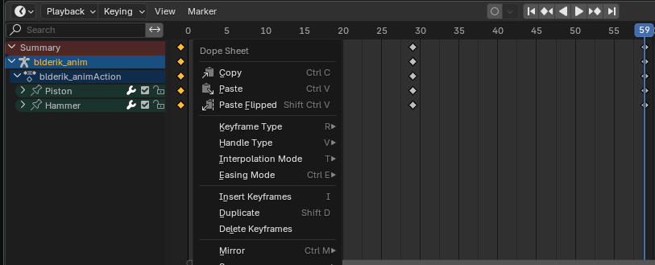
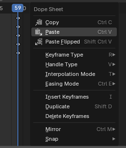

To check the animation, set the start frame to 0 and end frame to 59. 

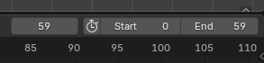

Now you can press space to play the animation and ESC to stop it, or use the play stop buttons.

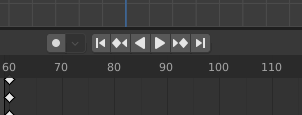

The animation is done, and we can do the export. Switch back to object mode. We need to set the cycles and frame time for both The Level3 “hammer” and the Level2 “piston” objects. Animation Cycles sets the number of repetitions for the animation. In our case, we leave it on 0. That means infinite repetitions. Animation Time is actually the time for one frame in milliseconds. Let's say we want the animation cycle to take two seconds (2000 milliseconds) to play. And we have 60 frames (0-59) . 2000 / 60 = 33.33 So we can set the value to 33. Set the same value for both Level3 “hammer” and the Level2 “piston.” That way they will be in sync.

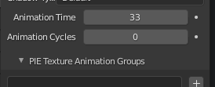

Now let's export the PIE. Switch to object mode, select the armature. Change Pie Version to 3 and make sure events are cleared.

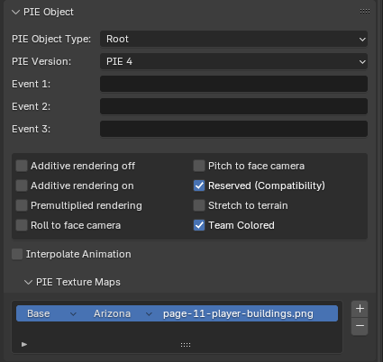

With the selected root armature, click on File – Export – Warzone 2100 model (.pie), select the location and click export pie to directory.

### Postprocessing

Now we have to do some cleanup because the export is causing a small issue. It adds empty lines to the file. Open the exported blderik_anim.pie in your preferred text editor and remove empty lines – usually on end of level polygons or Animobject frames.

Lastly, add INTERPOLATE 0 to a new line below TYPE 10200 and save the file.

You can now replace the file in the game structures folder and check if everything works.
